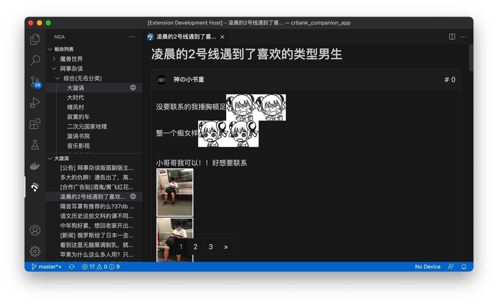

# NGA 程序喵 Vscode 摸鱼插件

> 感谢 DarrenIce 老哥的[插件](https://github.com/DarrenIce/NGA-MoFish)提供的灵感和素材

## Snapshot

## Features

- 提供全部板块选择
- 小型的帖子列表
- Github 风格的帖子内容展示

## Extension Settings

This extension contributes the following settings:

- `neko.cookie`: 登录后 NGA 的 Cookie，需要在插件中设置。

## TODO

- [x] Login
- [x] Topic list
- [x] Post list
- [ ] Post detail

## Release Notes

Users appreciate release notes as you update your extension.
